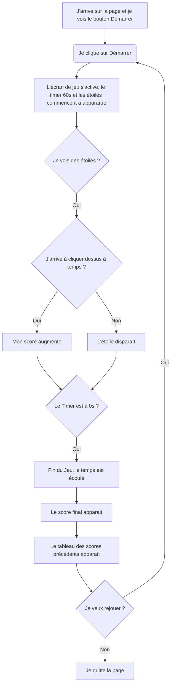

# VERSION 2 - testprojet2

Par rapport à la version 1, cette version introduit de nouvelles fonctionnalités liées au score et à la fin de la partie.

J’ai demandé à l’IA **Gemini** d’ajouter **l’affichage du score final** lorsque le timer arrive à son terme, ainsi qu’un **tableau récapitulatif des scores précédents**. Dans la version générée, le tableau apparaissait à la fois au début et à la fin de la partie.

J’ai donc modifié le code manuellement afin que ce **tableau ne s’affiche uniquement à la fin du jeu**, en supprimant les éléments que je ne souhaitais pas conserver. Enfin, j’ai ajusté **l’apparence du tableau**, notamment sa couleur, que j’ai changée en rose afin qu’elle soit cohérente avec l’esthétique générale du jeu.

## Diagramme de flux testprojet2

