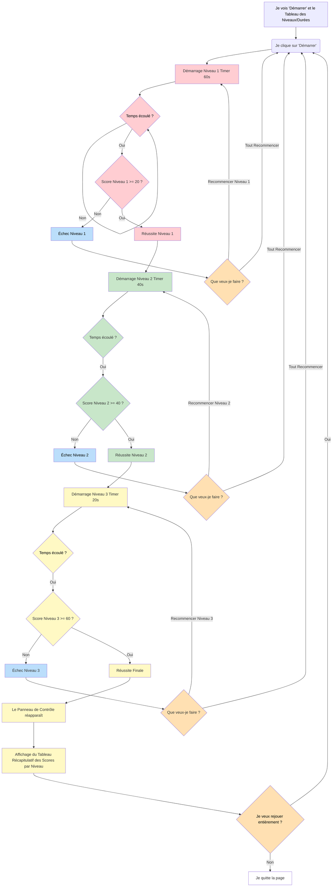

# VERSION 3

Par rapport à la version 2, cette version introduit un **système de niveaux** qui structure davantage le jeu et augmente progressivement la difficulté.

J’ai demandé à l’IA Gemini d’ajouter **trois niveaux**, chacun avec une durée spécifique :

- **Niveau 1** : 60 secondes
- **Niveau 2** : 40 secondes
- **Niveau 3** : 20 secondes

J’ai également demandé la création de **deux tableaux distincts** :

- Un **premier tableau affiché au début du jeu**, présentant les différents niveaux et leur durée.
- Un **second tableau affiché à la fin**, récapitulant le score obtenu pour chaque niveau.

La progression entre les niveaux est conditionnée par la réussite du niveau précédent :

- Pour valider le niveau 1, le joueur doit attraper au minimum **20 étoiles**.
- Pour le niveau 2, un minimum de **40 étoiles** est requis.
- Pour le niveau 3, il faut attraper au minimum **60 étoiles**.

Afin de renforcer la lisibilité et l’immersion, j’ai également demandé que **les étoiles aient une couleur différente selon le niveau**. Enfin, après l’intégration de ces éléments, j’ai retravaillé certains aspects du projet (couleurs, textes et espacements) afin d’obtenir un rendu visuel plus cohérent et conforme à mes attentes.

## Diagramme de flux testprojet3

