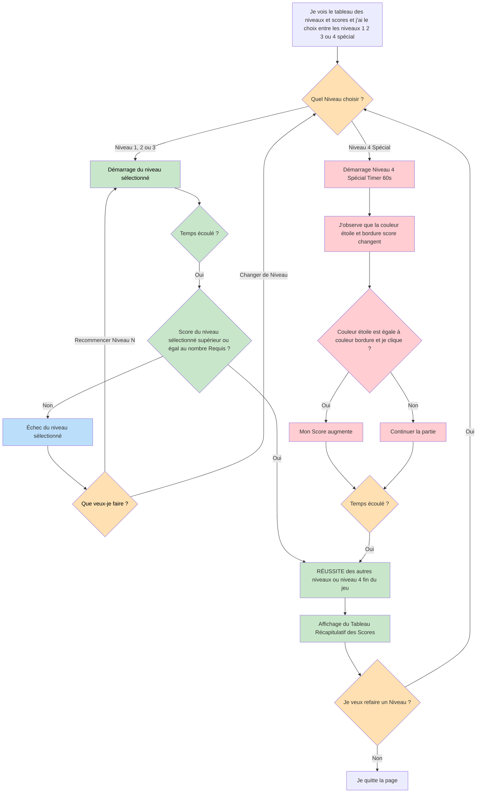

# VERSION 4 - testprojet4

Par rapport à la version 3, cette version apporte **une modification importante de la structure du jeu**, en laissant au joueur la liberté de **choisir directement le niveau** dès le lancement de la partie.

J’ai demandé à l’IA **Gemini** d’ajouter un **menu de sélection des niveaux**, permettant de choisir librement entre les trois niveaux existants. J’ai également demandé l’ajout d’un **niveau spécial**, dont la règle est différente : pour qu’une étoile soit comptabilisée, le joueur doit cliquer dessus uniquement lorsque sa couleur correspond à celle de la bordure du score. Cette couleur change toutes les 3 secondes. Le timer de ce niveau spécial est fixé à 60 secondes.

J’ai aussi demandé que chaque **bouton de niveau possède une couleur spécifique** afin de faciliter la compréhension :

- **Niveau 1** : vert
- **Niveau 2** : jaune
- **Niveau 3** : orange
- **Niveau spécial** : rouge
  
Une **phrase explicative** a également été ajoutée sur le côté de l’écran afin de clarifier la règle du niveau spécial pour le joueur.

Concernant les scores, j’ai demandé l’ajout d’un tableau de score affichant le meilleur score par niveau, qui apparaît uniquement à la fin de chaque partie. 

En parallèle, j’ai supprimé la condition de progression obligatoire entre les niveaux, ainsi que les tableaux qui s’affichaient avant le début du jeu, afin de simplifier l’expérience utilisateur.

Après la génération du code, j’ai apporté plusieurs modifications personnelles, j’ai ajusté les couleurs du niveau spécial en m’appuyant sur le site **palettesdecouleurs**, puis retravaillé le style général et les titres pour qu’ils correspondent à l’esthétique souhaitée.

Enfin, j’ai modifié la gestion du son, j’ai remplacé le son déclenché lors du clic sur une étoile par **Tone.Synth**, et ajouté un son différent (**Samples**) lorsqu’une erreur est commise dans le niveau spécial. Ces deux sons proviennent de la bibliothèque **Tone.js**.

## Diagramme de flux testprojet4

