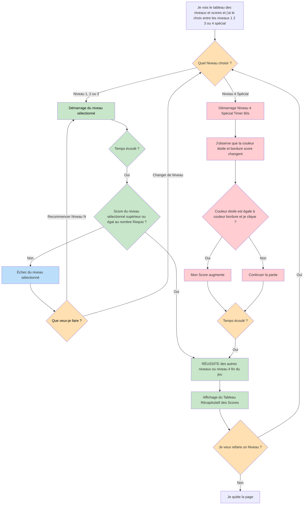

# VERSION 5

Par rapport à la version 4, cette version apporte une amélioration visuelle de la page de démarrage ainsi qu’un nouvel élément sonore.

J’ai utilisé l’IA **Gemini** pour ajouter un encadré sur la page de démarrage, afin d’améliorer l’esthétique générale et d’éviter que la page du jeu soit visible en arrière-plan avant le lancement d’une partie.

J’ai également ajouter le son **Instruments de la bibliothèque Tone.js**, qui se déclenche au démarrage d’une partie, renforçant ainsi l’immersion du joueur dès le début du jeu.

## Diagramme de flux testprojet5

