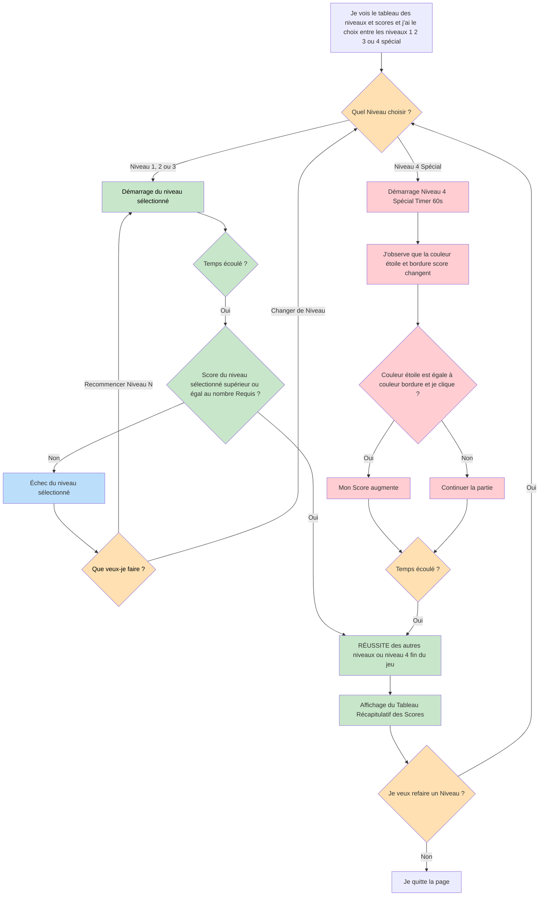

# VERSION 6

Par rapport à la version 5, cette version apporte des ajustements visuels et ergonomiques, en particulier pour le niveau spécial, ainsi qu’un nouvel élément sonore.

J’ai demandé à l’IA **Gemini** de faire en sorte que les **encadrés du jeu**, pour chaque niveau, aient la **même couleur que celle représentant le niveau**, afin d’améliorer la cohérence visuelle. J’ai également demandé que, dans le niveau spécial, le message de consigne soit affiché au début du jeu, et non plus dans un encadré sur le côté.

Ensuite, j’ai demandé l’ajout d’un **message minimaliste indiquant la couleur à cliquer**, correspondant à la couleur de la bordure de l’encadré du score. Ce message est placé sous l’encadré du score, afin de rester visible sans gêner le jeu. J’ai aussi souhaité l’ajout d’un petit message d’avertissement indiquant une pénalité de –1 point lorsque le joueur se trompe.

Enfin, j’ai ajouté un son signalant la fin de la partie, en utilisant **le son Signals de la bibliothèque Tone.js**, afin d’informer clairement le joueur que le jeu est terminé, et j'ai fait quelques changements esthétiques (couleurs,texte).

# Conclusion

Au fil des différentes versions, le projet Attrape les étoiles a évolué de manière progressive et structurée, tant sur le plan technique qu’esthétique. La version 0, générée par l’IA Gemini, a servi de base fonctionnelle et m’a permis de comprendre la structure du code.

Chaque nouvelle version a introduit des améliorations précises : ajout de fonctionnalités (timer, boutons, scores, niveaux), enrichissement du gameplay avec un niveau spécial, choix libre des niveaux et ajout progressif d’effets sonores via Tone.js.

Tout au long du projet, j’ai utilisé l’IA comme un outil d’aide, tout en personnalisant, corrigeant et améliorant chaque élément pour développer ma compréhension du code. L’attention portée aux couleurs, aux messages et aux sons a permis d’améliorer la lisibilité, l’esthétique et l’immersion, tout en rendant le jeu agréable et fonctionnel.

## Diagramme de flux testprojet6

